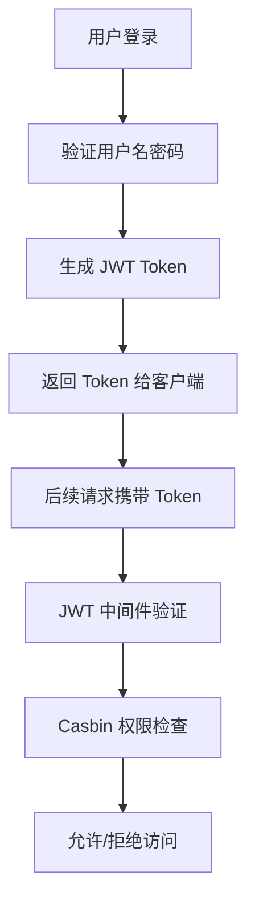
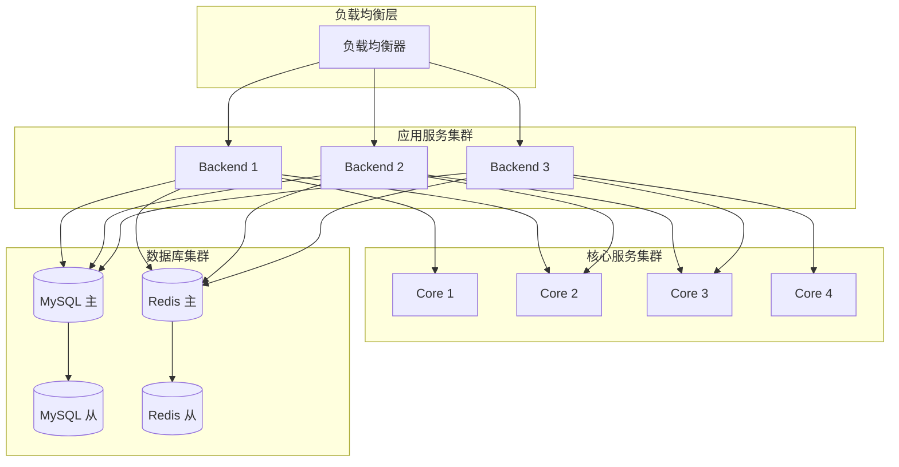

# Trojan Panel 系统架构知识库

## 📋 系统概览

Trojan Panel 是一个企业级多代理协议管理面板，采用微服务架构设计，支持多种代理协议的统一管理。

### 核心特性
- ✅ **多协议支持**: Xray-core、Trojan-Go、Hysteria、Hysteria2、NaiveProxy
- ✅ **微服务架构**: 三个独立组件，职责清晰
- ✅ **高可用性**: 支持负载均衡和故障转移
- ✅ **安全可靠**: JWT + RBAC 权限控制
- ✅ **易于扩展**: 插件化设计，支持水平扩展

### 架构优势
- 🎯 **职责分离**: 每个组件专注于特定功能
- 🔧 **技术解耦**: 可独立使用不同技术栈
- 🚀 **独立部署**: 支持灰度发布和滚动升级
- 📊 **监控完善**: 全链路监控和日志审计

## 🏗️ 系统架构

### 组件职责矩阵

| 组件 | 端口 | 主要职责 | 技术栈 | 通信方式 |
|------|------|----------|--------|----------|
| **trojan-panel-ui** | 8888 | 用户界面展示 | Vue.js + Element UI | HTTP/HTTPS |
| **trojan-panel-backend** | 8081 | 业务逻辑处理 | Gin + JWT + Casbin | HTTP/gRPC |
| **trojan-panel-core** | 8100 | 代理进程管理 | Go + gRPC | gRPC/进程API |

### 端口分配表

| 端口 | 服务 | 协议 | 用途 |
|------|------|------|------|
| 8888 | UI 前端 | HTTPS | 用户访问 |
| 8081 | Backend API | HTTP | 内部 API 调用 |
| 8100 | Core gRPC | gRPC | 后端服务通信 |
| 动态 | 代理服务 | 协议相关 | 用户代理连接 |

## 🔗 组件通信协议

### 1. UI ↔ Backend (HTTP/HTTPS)

#### 请求格式
```http
POST /api/auth/login HTTP/1.1
Host: trojan-panel.example.com:8888
Content-Type: application/json
Authorization: Bearer <token>

{
  "username": "admin",
  "password": "password"
}
```

#### 响应格式
```json
{
  "code": 200,
  "msg": "success",
  "data": {
    "token": "eyJhbGciOiJIUzI1NiIsInR5cCI6IkpXVCJ9...",
    "userInfo": {
      "id": 1,
      "username": "admin",
      "role": "sysadmin"
    }
  }
}
```

### 2. Backend ↔ Core (gRPC)

#### Protocol Buffers 定义
```protobuf
service ApiNodeService {
  rpc AddNode(NodeAddDto) returns (Response) {}
  rpc RemoveNode(NodeRemoveDto) returns (Response) {}
}

message NodeAddDto {
  uint64 nodeTypeId = 1;
  uint64 port = 2;
  string domain = 3;
  string xrayTemplate = 4;
  string xrayProtocol = 5;
  // ... 更多字段
}
```

#### gRPC 调用示例
```go
// 创建 gRPC 连接
conn, err := grpc.Dial(fmt.Sprintf("%s:%d", ip, grpcPort),
    grpc.WithTransportCredentials(insecure.NewCredentials()),
    grpc.WithPerRPCCredentials(&tokenParam),
)

// 调用远程服务
client := NewApiNodeServiceClient(conn)
response, err := client.AddNode(ctx, &NodeAddDto{
    NodeTypeId: nodeTypeId,
    Port:       port,
    Domain:     domain,
    // ... 更多参数
})
```

## 🗄️ 数据存储架构

### 数据库设计

| 数据库 | 用途 | 存储内容 | 连接方 |
|--------|------|----------|--------|
| **MySQL** | 主数据库 | 用户信息、节点配置、系统设置 | Backend + Core |
| **Redis** | 缓存层 | 会话信息、分布式锁、热点数据 | Backend + Core |
| **SQLite** | 本地缓存 | 节点运行状态、本地配置 | Core |

### 关键数据表

```sql
-- 用户账户表
CREATE TABLE account (
    id BIGINT PRIMARY KEY,
    username VARCHAR(50) UNIQUE,
    password_hash VARCHAR(255),
    email VARCHAR(100),
    quota BIGINT DEFAULT -1,
    download BIGINT DEFAULT 0,
    upload BIGINT DEFAULT 0,
    expire_time BIGINT,
    role_id INT,
    created_at TIMESTAMP,
    updated_at TIMESTAMP
);

-- 代理节点表
CREATE TABLE node (
    id BIGINT PRIMARY KEY,
    node_type_id INT,
    node_server_id INT,
    port INT,
    domain VARCHAR(255),
    config TEXT,
    status INT,
    created_at TIMESTAMP,
    updated_at TIMESTAMP
);

-- 节点服务器表
CREATE TABLE node_server (
    id BIGINT PRIMARY KEY,
    name VARCHAR(100),
    ip VARCHAR(50),
    grpc_port INT,
    cpu_usage FLOAT,
    memory_usage FLOAT,
    disk_usage FLOAT,
    status INT,
    created_at TIMESTAMP,
    updated_at TIMESTAMP
);
```

## 🔐 安全机制

### 认证授权流程



### 安全措施

1. **传输安全**
   - HTTPS 加密传输
   - gRPC Token 认证
   - API 接口签名

2. **数据安全**
   - 密码 bcrypt 加密
   - 敏感数据脱敏
   - 数据库访问控制

3. **访问控制**
   - JWT Token 过期机制
   - RBAC 权限模型
   - API 访问频率限制

4. **审计日志**
   - 操作日志记录
   - 异常行为监控
   - 安全事件告警

## 🚀 部署架构

### 单机部署

```bash
# 启动顺序
1. MySQL 数据库服务
2. Redis 缓存服务
3. trojan-panel-core (端口 8100)
4. trojan-panel-backend (端口 8081)
5. Nginx + trojan-panel-ui (端口 8888)
```

### 集群部署



## 📊 监控指标

### 系统监控

| 指标类型 | 监控项 | 告警阈值 |
|----------|--------|----------|
| **CPU 使用率** | 系统整体 CPU | > 80% |
| **内存使用率** | 系统内存占用 | > 85% |
| **磁盘使用率** | 数据目录空间 | > 90% |
| **网络流量** | 入站/出站流量 | 异常峰值 |

### 业务监控

| 指标类型 | 监控项 | 告警阈值 |
|----------|--------|----------|
| **API 响应时间** | 接口平均响应时间 | > 2s |
| **API 错误率** | 接口失败率 | > 5% |
| **数据库连接** | 连接池使用率 | > 80% |
| **缓存命中率** | Redis 缓存命中率 | < 90% |

### 代理监控

| 指标类型 | 监控项 | 告警阈值 |
|----------|--------|----------|
| **节点状态** | 代理进程在线数 | < 预期值 |
| **用户连接数** | 活跃用户数量 | 异常峰值 |
| **流量统计** | 用户流量使用 | 接近限额 |
| **进程重启** | 异常重启次数 | > 3次/小时 |

## 🛠️ 运维工具

### 配置管理

```bash
# 环境配置
export NODE_ENV=production
export MYSQL_HOST=localhost
export MYSQL_PORT=3306
export REDIS_HOST=localhost
export REDIS_PORT=6379

# 启动脚本
#!/bin/bash
# start-trojan-panel.sh
./trojan-panel-core --config=config/core.ini &
./trojan-panel-backend --config=config/backend.ini &
nginx -c config/nginx.conf
```

### 健康检查

```bash
# 检查服务状态
curl -f http://localhost:8081/api/health || echo "Backend unhealthy"
curl -f http://localhost:8100/health || echo "Core unhealthy"

# 检查数据库连接
mysql -h localhost -u root -p -e "SELECT 1" || echo "MySQL unavailable"
redis-cli ping || echo "Redis unavailable"
```

### 日志管理

```bash
# 日志轮转
/var/log/trojan-panel/*.log {
    daily
    rotate 30
    compress
    delaycompress
    missingok
    notifempty
    create 644 root root
}

# 日志分析
grep "ERROR" /var/log/trojan-panel/backend.log | tail -n 100
grep "WARN" /var/log/trojan-panel/core.log | tail -n 50
```

## 🔧 开发指南

### 环境搭建

```bash
# 克隆代码
git clone https://github.com/jonssonyan/trojan-panel.git
cd trojan-panel

# 安装依赖
go mod tidy
npm install

# 编译项目
cd trojan-panel-core && go build -o trojan-panel-core
cd ../trojan-panel-backend && go build -o trojan-panel-backend
cd ../trojan-panel-ui && npm run build
```

### 调试技巧

```bash
# 启用调试模式
export GIN_MODE=debug
export LOG_LEVEL=debug

# 查看 gRPC 接口
grpcurl -plaintext localhost:8100 list
grpcurl -plaintext localhost:8100 describe ApiNodeService

# 测试 API 接口
curl -X POST http://localhost:8081/api/auth/login \
  -H "Content-Type: application/json" \
  -d '{"username":"admin","password":"password"}'
```

### 扩展开发

```go
// 添加新的代理协议
type NewProtocol struct {
    config *Config
    process *Process
}

func (n *NewProtocol) Start() error {
    // 启动逻辑
}

func (n *NewProtocol) Stop() error {
    // 停止逻辑
}

// 在 core/app/app.go 中注册
case constant.NewProtocol:
    if err := newprotocol.StartNewProtocol(...); err != nil {
        return err
    }
```

## 📈 性能优化

### 数据库优化

```sql
-- 添加索引
CREATE INDEX idx_account_username ON account(username);
CREATE INDEX idx_node_type_id ON node(node_type_id);
CREATE INDEX idx_node_server_id ON node(node_server_id);

-- 查询优化
EXPLAIN SELECT * FROM account WHERE username = 'admin';
EXPLAIN SELECT * FROM node WHERE node_type_id = 1;
```

### 缓存优化

```go
// Redis 缓存策略
func GetAccountCache(key string) (*Account, error) {
    // 先查缓存
    cached, err := redis.Get(key)
    if err == nil {
        return json.Unmarshal(cached)
    }
    
    // 缓存未命中，查数据库
    account, err := mysql.GetAccount(key)
    if err != nil {
        return nil, err
    }
    
    // 写入缓存
    redis.Set(key, json.Marshal(account), 5*time.Minute)
    return account, nil
}
```

### 并发优化

```go
// 连接池配置
db.SetMaxOpenConns(100)
db.SetMaxIdleConns(20)
db.SetConnMaxLifetime(5 * time.Minute)

// 并发控制
var wg sync.WaitGroup
semaphore := make(chan struct{}, 10) // 限制并发数

for _, item := range items {
    wg.Add(1)
    go func(item Item) {
        defer wg.Done()
        semaphore <- struct{}{}
        defer func() { <-semaphore }()
        
        // 处理逻辑
        processItem(item)
    }(item)
}
wg.Wait()
```

## 🚨 故障排查

### 常见问题

| 问题描述 | 可能原因 | 解决方案 |
|----------|----------|----------|
| **服务无法启动** | 端口被占用 | 检查端口占用，修改配置 |
| **数据库连接失败** | 连接数过多 | 调整连接池配置 |
| **gRPC 调用超时** | 网络问题 | 检查网络连接和防火墙 |
| **代理节点离线** | 进程崩溃 | 查看进程日志，重启服务 |
| **API 响应慢** | 数据库慢查询 | 优化 SQL 语句，添加索引 |

### 日志分析

```bash
# 查看错误日志
grep "ERROR" /var/log/trojan-panel/*.log | grep "$(date +%Y-%m-%d)"

# 分析慢查询
grep "slow query" /var/log/mysql/mysql-slow.log

# 监控系统资源
top -p $(pgrep trojan-panel)
htop
iostat -x 1
```

### 性能分析

```bash
# CPU 分析
go tool pprof http://localhost:8081/debug/pprof/profile

# 内存分析
go tool pprof http://localhost:8081/debug/pprof/heap

# goroutine 分析
go tool pprof http://localhost:8081/debug/pprof/goroutine
```

## 📝 总结

Trojan Panel 是一个设计精良的代理管理面板，通过微服务架构实现了高可用、高扩展性的系统设计。三个组件各司其职，通过标准化的通信协议进行协作，形成了一个完整的管理闭环。

### 关键优势
- 🎯 **架构清晰**: 微服务设计，职责明确
- 🔧 **技术先进**: 使用现代技术栈，性能优异
- 🛡️ **安全可靠**: 完善的安全机制和权限控制
- 🚀 **易于扩展**: 支持水平扩展和功能扩展
- 📊 **监控完善**: 全链路监控和日志审计

### 适用场景
- 企业级代理服务管理
- 多协议代理统一管理
- 高并发用户访问场景
- 分布式部署环境
- 需要精细权限控制的场景

这个知识库涵盖了 Trojan Panel 系统的各个方面，可以作为开发、运维、排障的重要参考资料。