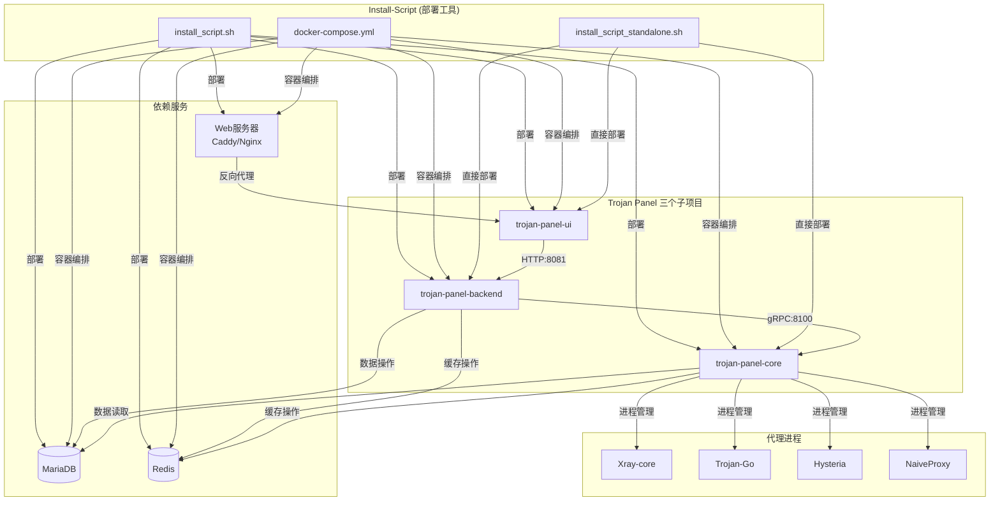
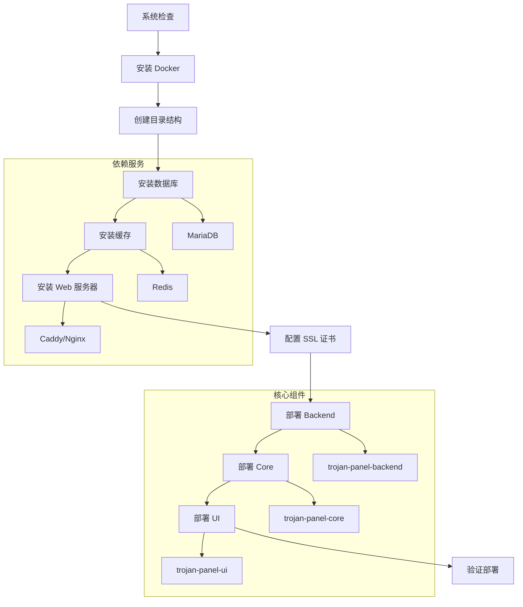

# Trojan Panel 安装脚本深度分析报告

## 📋 分析概述

本报告深入分析了 Trojan Panel 项目的安装脚本组件 (install-script)，以及其与三个核心子项目 (trojan-panel-core, trojan-panel-backend, trojan-panel-ui) 的关系和部署机制。

## 🏗️ Install-Script 组件分析

### 1. 组件结构

```
install-script/
├── README.md                    # 英文说明文档
├── README_ZH.md                 # 中文说明文档
├── README_ARCHIVE.md            # 历史版本说明
├── install_script.sh            # 主要安装脚本 (Docker 版本)
├── install_script_standalone.sh # 单机安装脚本
├── docker-compose.yml           # Docker 编排配置
└── archive/                     # 历史版本脚本
    ├── install_script_v2.1.5.sh
    ├── install_script_v2.1.6.sh
    ├── install_script_v2.1.7.sh
    ├── install_script_v2.1.8.sh
    ├── install_script_v2.2.0.sh
    ├── install_script_v2.2.1.sh
    ├── install_script_v2.3.0.sh
    ├── install_script_v2.3.1.sh
    └── install_script_v2.3.2.sh
```

### 2. 安装脚本功能定位

Install-Script 是 Trojan Panel 项目的**部署自动化工具**，负责：

- **环境准备**: 系统依赖检查、Docker 安装、网络配置
- **服务部署**: 三个核心组件的自动化部署和配置
- **依赖管理**: MariaDB、Redis、Caddy/Nginx 等依赖服务
- **证书管理**: SSL 证书自动申请和配置
- **运维支持**: 服务更新、故障排查、日志查询

## 🔗 与三个子项目的关系

### 1. 部署架构关系



### 2. 具体部署关系

#### 2.1 与 trojan-panel-ui 的关系

**部署方式**:
```bash
# Docker 容器部署
docker pull jonssonyan/trojan-panel-ui
docker run -d --name trojan-panel-ui --restart always \
  --network=host \
  -v "/tpdata/trojan-panel-ui/nginx/default.conf:/etc/nginx/conf.d/default.conf" \
  -v "/tpdata/cert/:/tpdata/cert/" \
  jonssonyan/trojan-panel-ui
```

**配置管理**:
- **Nginx 配置**: 自动生成反向代理配置
- **SSL 证书**: 自动配置 HTTPS 支持
- **API 代理**: 配置 `/api` 路径代理到 backend
- **静态文件**: 直接提供前端静态文件服务

**端口分配**:
- **默认端口**: 8888 (HTTPS)
- **可配置**: 支持用户自定义端口

#### 2.2 与 trojan-panel-backend 的关系

**部署方式**:
```bash
# Docker 容器部署
docker pull jonssonyan/trojan-panel
docker run -d --name trojan-panel --restart always \
  --network=host \
  -v "/tpdata/web/:/tpdata/trojan-panel/webfile/" \
  -v "/tpdata/trojan-panel/logs/:/tpdata/trojan-panel/logs/" \
  -v "/tpdata/trojan-panel/config/:/tpdata/trojan-panel/config/" \
  -v "/etc/localtime:/etc/localtime" \
  -e "GIN_MODE=release" \
  -e "mariadb_ip=127.0.0.1" \
  -e "mariadb_port=9507" \
  -e "mariadb_user=root" \
  -e "mariadb_pas=${mariadb_pas}" \
  -e "redis_host=127.0.0.1" \
  -e "redis_port=6378" \
  -e "redis_pass=${redis_pass}" \
  -e "server_port=8081" \
  jonssonyan/trojan-panel
```

**配置管理**:
- **数据库连接**: 自动配置 MySQL 连接参数
- **Redis 连接**: 自动配置缓存连接
- **环境变量**: 通过环境变量注入配置
- **配置文件**: 持久化配置到 `/tpdata/trojan-panel/config/`

**端口分配**:
- **API 端口**: 8081 (HTTP)
- **可配置**: 支持用户自定义端口

#### 2.3 与 trojan-panel-core 的关系

**部署方式**:
```bash
# Docker 容器部署
docker pull jonssonyan/trojan-panel-core
docker run -d --name trojan-panel-core --restart always \
  --network=host \
  -v "/tpdata/trojan-panel-core/bin/xray/config/:/tpdata/trojan-panel-core/bin/xray/config/" \
  -v "/tpdata/trojan-panel-core/bin/trojango/config/:/tpdata/trojan-panel-core/bin/trojango/config/" \
  -v "/tpdata/trojan-panel-core/bin/hysteria/config/:/tpdata/trojan-panel-core/bin/hysteria/config/" \
  -v "/tpdata/trojan-panel-core/bin/naiveproxy/config/:/tpdata/trojan-panel-core/bin/naiveproxy/config/" \
  -v "/tpdata/trojan-panel-core/bin/hysteria2/config/:/tpdata/trojan-panel-core/bin/hysteria2/config/" \
  -v "/tpdata/trojan-panel-core/logs/:/tpdata/trojan-panel-core/logs/" \
  -v "/tpdata/trojan-panel-core/config/:/tpdata/trojan-panel-core/config/" \
  -v "/tpdata/cert/:/tpdata/cert/" \
  -v "/tpdata/web/:/tpdata/web/" \
  -v "/etc/localtime:/etc/localtime" \
  -e "GIN_MODE=release" \
  -e "mariadb_ip=127.0.0.1" \
  -e "mariadb_port=9507" \
  -e "mariadb_user=root" \
  -e "mariadb_pas=${mariadb_pas}" \
  -e "database=trojan_panel_db" \
  -e "account-table=account" \
  -e "redis_host=127.0.0.1" \
  -e "redis_port=6378" \
  -e "redis_pass=${redis_pass}" \
  -e "crt_path=/tpdata/cert/${domain}.crt" \
  -e "key_path=/tpdata/cert/${domain}.key" \
  -e "grpc_port=8100" \
  -e "server_port=8082" \
  jonssonyan/trojan-panel-core
```

**配置管理**:
- **代理配置**: 为每种代理协议创建配置目录
- **证书管理**: 自动配置 SSL 证书路径
- **gRPC 服务**: 配置 gRPC 服务端口
- **数据库连接**: 配置数据库连接参数

**端口分配**:
- **gRPC 端口**: 8100 (与 backend 通信)
- **HTTP 端口**: 8082 (可选，用于调试)
- **代理端口**: 动态分配 (根据用户配置)

## 🚀 部署流程分析

### 1. 完整部署流程



### 2. 交互式配置流程

安装脚本提供了完整的交互式配置流程：

1. **基础配置**:
   - 数据库端口、用户名、密码
   - Redis 端口、密码
   - Web 服务器端口配置

2. **SSL 配置**:
   - 域名配置
   - 证书申请方式 (自动/手动)
   - 证书颁发机构选择

3. **组件配置**:
   - 各组件端口分配
   - 服务间通信地址
   - 网络模式选择

### 3. 数据持久化策略

```bash
# 目录结构
/tpdata/
├── cert/                    # SSL 证书
├── web/                     # 静态文件
├── mariadb/                 # MariaDB 数据
├── redis/                   # Redis 数据
├── caddy/                   # Caddy 配置和日志
├── nginx/                   # Nginx 配置
├── trojan-panel-ui/         # UI 相关配置
├── trojan-panel/            # Backend 相关配置
└── trojan-panel-core/       # Core 相关配置
    ├── bin/                 # 代理程序配置
    │   ├── xray/config/
    │   ├── trojango/config/
    │   ├── hysteria/config/
    │   ├── naiveproxy/config/
    │   └── hysteria2/config/
    ├── logs/                # 日志文件
    └── config/              # 配置文件
```

## 📦 Docker 编排配置

### 1. Docker Compose 配置分析

```yaml
version: '3'

services:
  # Web 服务器
  trojan-panel-caddy:
    image: caddy:2.6.2
    container_name: trojan-panel-caddy
    restart: always
    network_mode: host
    volumes:
      - "/tpdata/caddy/config.json:/tpdata/caddy/config.json"
      - "/tpdata/cert/:/tpdata/cert/certificates/acme-v02.api.letsencrypt.org-directory/${domain}/"
      - "/tpdata/web/:/tpdata/web/"
      - "/tpdata/caddy/logs/:/tpdata/caddy/logs/"
  
  # 数据库
  trojan-panel-mariadb:
    image: mariadb:10.7.3
    container_name: trojan-panel-mariadb
    restart: always
    network_mode: host
    environment:
      MYSQL_DATABASE: trojan_panel_db
      MYSQL_ROOT_PASSWORD: "${mariadb_pas}"
      TZ: Asia/Shanghai
    command: --port=9507
  
  # 缓存
  trojan-panel-redis:
    image: redis:6.2.7
    container_name: trojan-panel-redis
    restart: always
    network_mode: host
    command: redis-server --requirepass ${redis_pass} --port 6378
  
  # Backend
  trojan-panel:
    image: jonssonyan/trojan-panel
    container_name: trojan-panel
    restart: always
    network_mode: host
    volumes:
      - "/tpdata/web/:/tpdata/trojan-panel/webfile/"
      - "/tpdata/trojan-panel/logs/:/tpdata/trojan-panel/logs/"
      - "/tpdata/trojan-panel/config/:/tpdata/trojan-panel/config/"
      - "/etc/localtime:/etc/localtime"
    environment:
      - "GIN_MODE=release"
      - "mariadb_ip=127.0.0.1"
      - "mariadb_port=9507"
      - "mariadb_user=root"
      - "mariadb_pas=${mariadb_pas}"
      - "redis_host=127.0.0.1"
      - "redis_port=6378"
      - "redis_pass=${redis_pass}"
      - "server_port=8081"
  
  # UI
  trojan-panel-ui:
    image: jonssonyan/trojan-panel-ui
    container_name: trojan-panel-ui
    restart: always
    network_mode: host
    volumes:
      - "/tpdata/trojan-panel-ui/nginx/default.conf:/etc/nginx/conf.d/default.conf"
      - "/tpdata/cert/:/tpdata/cert/"
  
  # Core
  trojan-panel-core:
    image: jonssonyan/trojan-panel-core
    container_name: trojan-panel-core
    restart: always
    network_mode: host
    volumes:
      - "/tpdata/trojan-panel-core/bin/xray/config/:/tpdata/trojan-panel-core/bin/xray/config/"
      - "/tpdata/trojan-panel-core/bin/trojango/config/:/tpdata/trojan-panel-core/bin/trojango/config/"
      - "/tpdata/trojan-panel-core/bin/hysteria/config/:/tpdata/trojan-panel-core/bin/hysteria/config/"
      - "/tpdata/trojan-panel-core/bin/naiveproxy/config/:/tpdata/trojan-panel-core/bin/naiveproxy/config/"
      - "/tpdata/trojan-panel-core/bin/hysteria2/config/:/tpdata/trojan-panel-core/bin/hysteria2/config/"
      - "/tpdata/trojan-panel-core/logs/:/tpdata/trojan-panel-core/logs/"
      - "/tpdata/trojan-panel-core/config/:/tpdata/trojan-panel-core/config/"
      - "/tpdata/cert/:/tpdata/cert/"
      - "/tpdata/web/:/tpdata/web/"
      - "/etc/localtime:/etc/localtime"
    environment:
      - "GIN_MODE=release"
      - "mariadb_ip=127.0.0.1"
      - "mariadb_port=9507"
      - "mariadb_user=root"
      - "mariadb_pas=${mariadb_pas}"
      - "database=trojan_panel_db"
      - "account-table=account"
      - "redis_host=127.0.0.1"
      - "redis_port=6378"
      - "redis_pass=${redis_pass}"
      - "crt_path=/tpdata/cert/${domain}.crt"
      - "key_path=/tpdata/cert/${domain}.key"
      - "grpc_port=8100"
      - "server_port=8082"
```

### 2. 网络模式选择

**Host 网络模式**:
- **优势**: 性能最优，网络延迟最低
- **适用**: 生产环境部署
- **特点**: 容器与宿主机共享网络栈

**Bridge 网络模式**:
- **优势**: 隔离性好，安全性高
- **适用**: 开发测试环境
- **特点**: 容器间通过 Docker 网桥通信

## 🔧 运维功能分析

### 1. 服务管理功能

```bash
# 安装脚本提供的运维功能
1. 安装功能
   - 安装 UI/Backend/Core
   - 安装依赖服务 (MariaDB/Redis/Caddy/Nginx)
   
2. 更新功能
   - 在线更新各组件
   - 数据库结构自动升级
   - 配置文件迁移
   
3. 卸载功能
   - 单独卸载某个组件
   - 全部卸载
   - 数据清理
   
4. 配置管理
   - 修改端口
   - 更换证书
   - 重置密码
   
5. 故障排查
   - 服务状态检查
   - 日志查询
   - 版本信息查询
```

### 2. 故障检测机制

安装脚本包含完整的故障检测功能：

```bash
# 故障检测内容
- Docker 服务状态
- 各容器运行状态
- 网络连接状态
- 证书有效性
- 数据库连接
- Redis 连接
- 磁盘空间
- 内存使用
```

### 3. 日志管理

```bash
# 日志查询功能
- Backend 日志: /tpdata/trojan-panel/logs/trojan-panel.log
- Core 日志: /tpdata/trojan-panel-core/logs/trojan-panel.log
- 容器日志: docker logs <container_name>
- Web 服务器日志: /tpdata/caddy/logs/ 或 /tpdata/nginx/logs/
```

## 📊 版本管理策略

### 1. 版本兼容性

安装脚本支持版本管理：

```bash
# 版本检测和升级
- 自动检测当前版本
- 检查最新版本
- 版本兼容性验证
- 数据库结构升级
- 配置文件迁移
```

### 2. 历史版本支持

Archive 目录包含历史版本脚本：

- **v2.1.5**: 支持 Hysteria2 协议
- **v2.1.6**: 修复权限问题
- **v2.1.7**: 性能优化
- **v2.1.8**: 安全性增强
- **v2.2.0**: 新功能特性
- **v2.2.1**: Bug 修复
- **v2.3.0**: 重大更新
- **v2.3.1**: 稳定性改进
- **v2.3.2**: 最新版本

## 🎯 部署最佳实践

### 1. 生产环境部署

```bash
# 推荐部署顺序
1. 系统环境准备
2. 安装 Docker
3. 运行安装脚本
4. 配置域名和 SSL
5. 部署三个核心组件
6. 验证功能完整性
7. 配置监控和备份
```

### 2. 安全配置

```bash
# 安全建议
- 使用强密码
- 配置防火墙
- 定期更新组件
- 备份重要数据
- 监控系统状态
- 限制访问权限
```

### 3. 性能优化

```bash
# 性能优化建议
- 使用 SSD 硬盘
- 配置足够的内存
- 优化数据库参数
- 启用 Redis 缓存
- 监控资源使用
```

## 📝 总结

### 关键发现

1. **完整的部署解决方案**: Install-Script 提供了从环境准备到服务部署的完整解决方案

2. **灵活的部署方式**: 支持 Docker 容器化和单机部署两种方式

3. **自动化程度高**: 大部分配置和部署过程都是自动化的

4. **运维功能完善**: 提供了丰富的运维管理功能

5. **版本管理规范**: 支持版本升级和回滚

### 与三个子项目的关系

- **trojan-panel-ui**: 作为前端界面，通过 Nginx 提供 Web 服务
- **trojan-panel-backend**: 作为业务逻辑层，提供 API 服务
- **trojan-panel-core**: 作为代理管理层，管理各种代理进程
- **install-script**: 作为部署工具，自动化部署和管理整个系统

### 价值体现

1. **降低部署门槛**: 一键安装，无需专业知识
2. **提高部署效率**: 自动化流程，减少人工操作
3. **保证部署一致性**: 标准化配置，避免环境差异
4. **简化运维工作**: 提供完整的运维管理功能
5. **支持扩展部署**: 支持分布式部署和集群部署

这个安装脚本是 Trojan Panel 项目的重要组成部分，它使得复杂的微服务架构变得易于部署和管理，为项目的推广和使用提供了强有力的支撑。