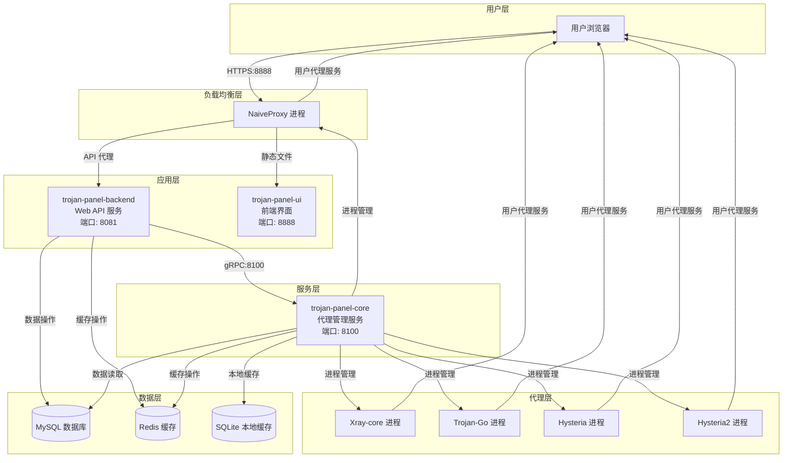
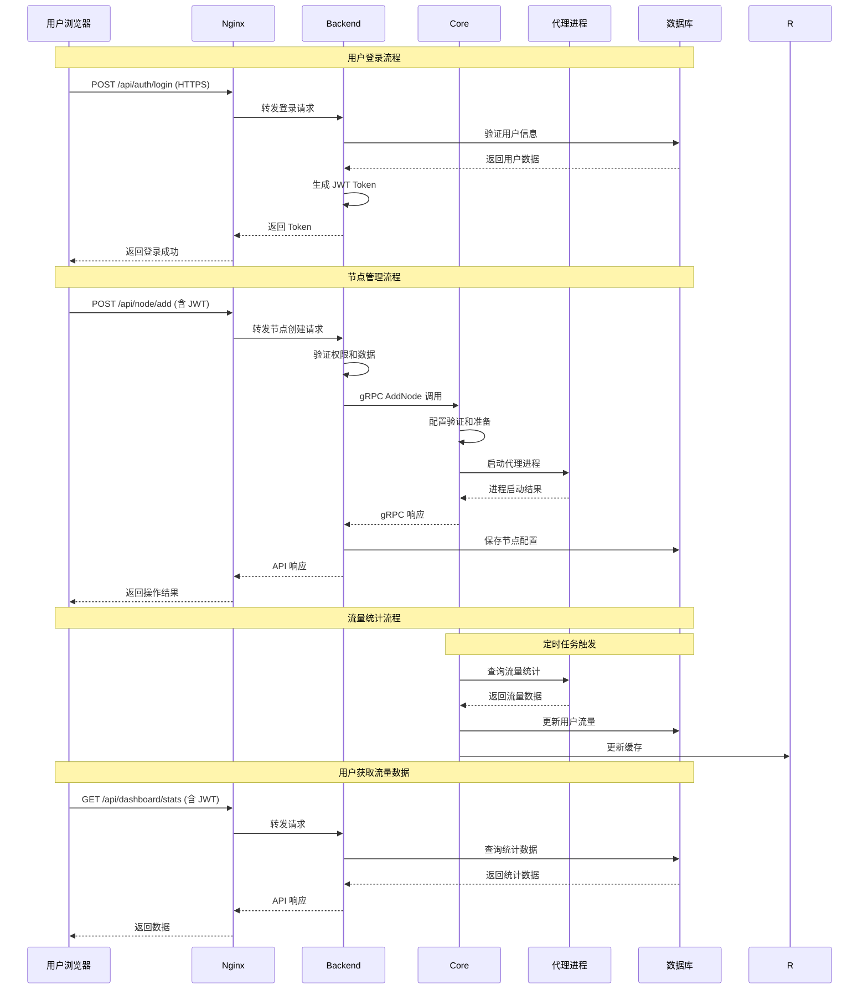
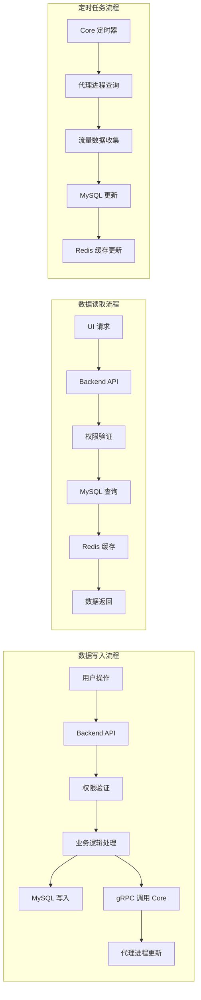
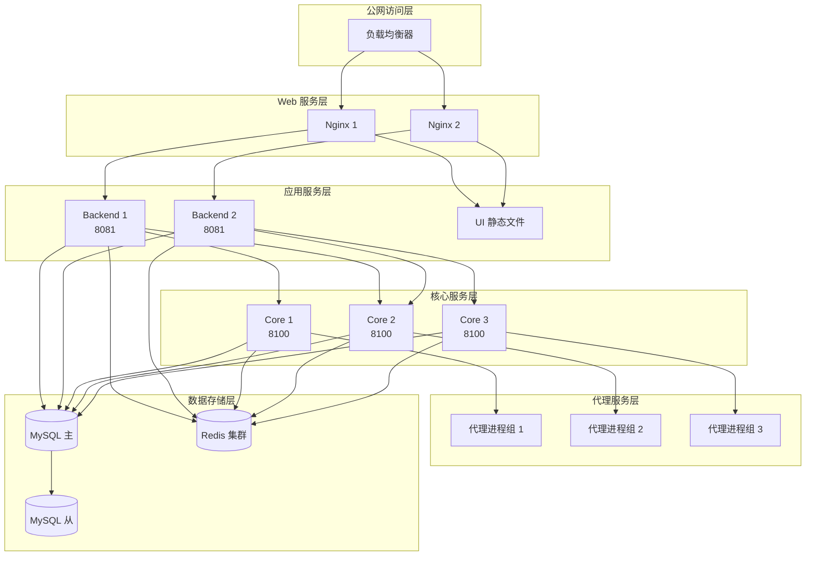
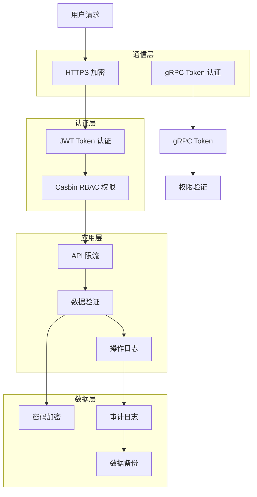
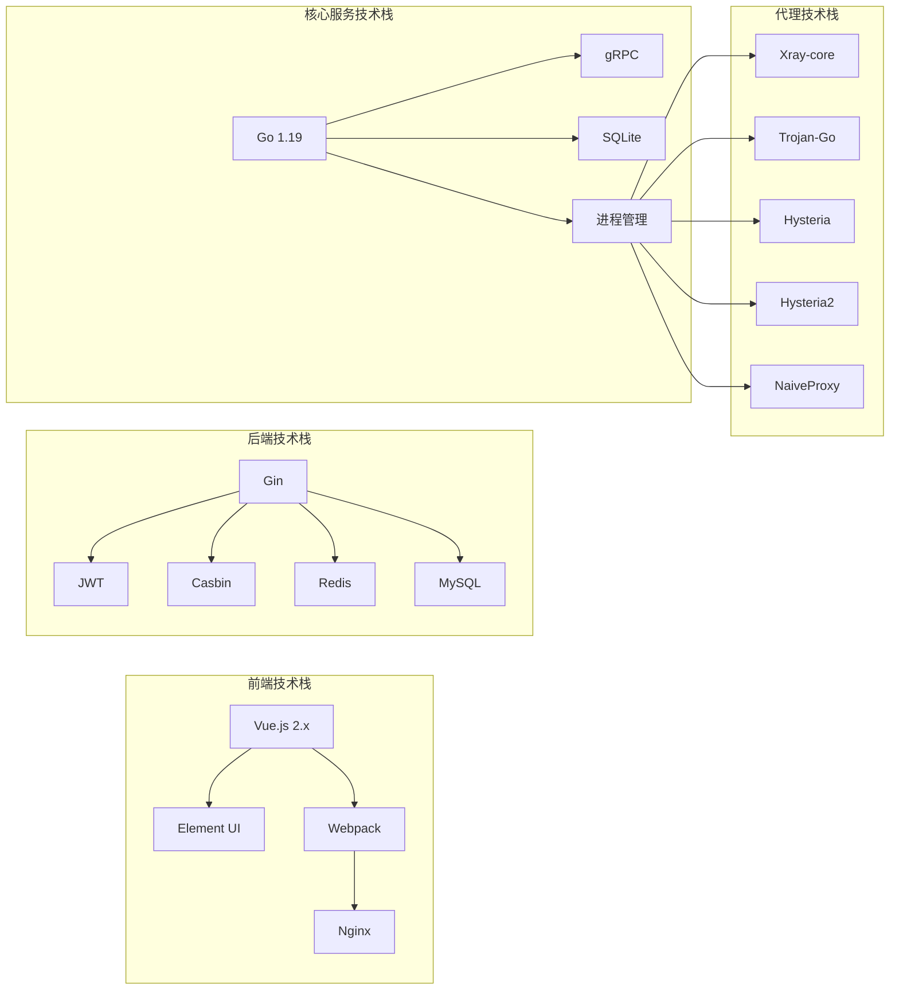
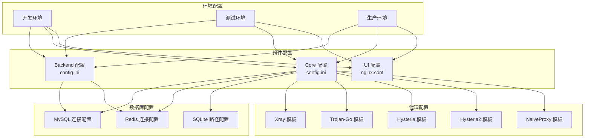

# Trojan Panel 系统架构图

## 1. 整体架构图

## 2. 组件间通信协议图

## 3. 数据流架构图

## 4. 部署架构图

## 5. 安全架构图

## 6. 技术栈架构图

## 7. 接口架构图

```mermaid
graph TB
    subgraph "前端接口 (HTTP/JSON)"
        A1[POST /api/auth/login]
        A2[GET /api/auth/info]
        A3[GET /api/account/list]
        A4[POST /api/account/add]
        A5[PUT /api/account/update]
        A6[DELETE /api/account/delete]
        A7[GET /api/node/list]
        A8[POST /api/node/add]
        A9[DELETE /api/node/remove]
    end
    
    subgraph "后端接口 (HTTP/JSON)"
        B1[GET /api/dashboard/stats]
        B2[GET /api/system/info]
        B3[POST /api/system/config]
        B4[GET /api/node-server/list]
        B5[POST /api/node-server/add]
    end
    
    subgraph "gRPC 接口 (Protocol Buffers)"
        C1[ApiNodeService.AddNode]
        C2[ApiNodeService.RemoveNode]
        C3[ApiAccountService.RemoveAccount]
        C4[ApiStateService.GetNodeState]
        C5[ApiStateService.GetNodeServerState]
        C6[ApiNodeServerService.GetNodeServerInfo]
    end
    
    subgraph "代理进程 API"
        D1[Xray API]
        D2[Trojan-Go API]
        D3[Hysteria API]
        D4[Hysteria2 API]
        D5[NaiveProxy API]
    end
    
    %% 接口调用关系
    A1 --> B1
    A3 --> B1
    A7 --> B1
    
    A8 --> C1
    A9 --> C2
    A6 --> C3
    
    C1 --> D1
    C1 --> D2
    C1 --> D3
    C1 --> D4
    C1 --> D5
```

## 8. 配置架构图

这些架构图完整展示了 Trojan Panel 系统的各个方面，包括组件关系、数据流、部署架构、安全机制等。通过这些图表，可以清晰地理解整个系统的工作原理和架构设计。